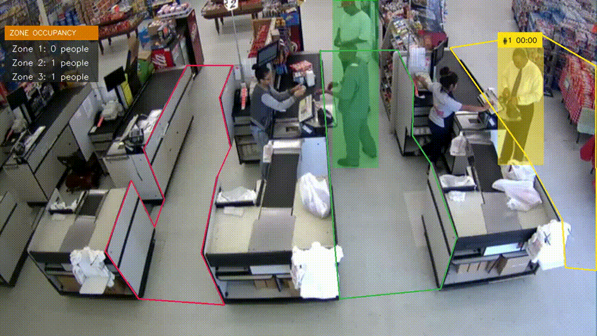
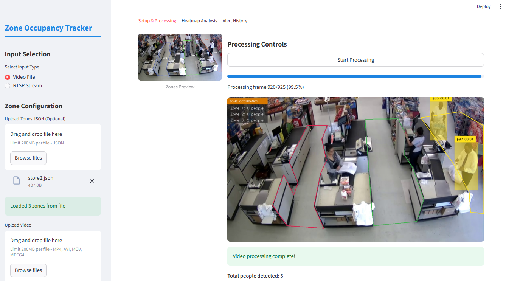

# 🕒 RDT - AI-Powered Dwell Time Analytics for Smart Retail

[](https://www.python.org/downloads/)
[](https://github.com/ultralytics/ultralytics)
[](https://github.com/roboflow/supervision)
[](https://streamlit.io/)
[](https://opensource.org/licenses/MIT)

RDT uses AI-driven computer vision to track and analyze dwell time, providing real-time insights for retail.




## 📋 Table of Contents

- [Overview](#-overview)
- [Practical Applications](#-practical-applications)
- [Project Structure](#-project-structure)
- [Features](#-features)
- [Installation](#-installation)
- [Usage](#-usage)
  - [Streamlit Web Interface](#streamlit-web-interface)
  - [Command Line Interface](#command-line-interface)
  - [Drawing Zones](#drawing-zones)
  - [RTSP Streaming](#rtsp-streaming)
- [Custom Model Training](#-custom-model-training)
- [Performance Tips](#-performance-tips)
- [Troubleshooting](#-troubleshooting)
- [Future Implementations](#-future-implementations)

## 🔭 Overview

RDT (Retail Dwell Time) helps you analyze how long people spend in specific areas of a retail environment. The system uses state-of-the-art computer vision models (YOLOv8) and object tracking algorithms (ByteTrack) to:

1. **Detect** people and other objects in video feeds
2. **Track** them as they move through the scene
3. **Calculate** time spent in user-defined zones
4. **Visualize** results with intuitive dashboards and overlays
5. **Export** data for further analysis

This makes it ideal for retail analytics, queue management, and space utilization analysis.

## 🗂️ Project Structure

```
RDT/
├── calculate_zone_time/     # Core module for zone time calculation
│   ├── core/                # Detection and tracking components
│   ├── visualization/       # Frame annotation tools
│   ├── utils/               # Helper utilities
│   └── scripts/             # Utility scripts (zone drawing, RTSP streaming)
├── customer_vision/         # Training pipeline for custom models
│   ├── components/          # Pipeline components (data ingestion, training)
│   ├── entity/              # Configuration classes
│   └── pipeline/            # Training orchestration
├── streamlit_app/           # User-friendly web interface
│   ├── processing/          # Video and RTSP processing
│   ├── analytics/           # Data visualization components
│   ├── alerts/              # Alert system
│   └── utils/               # Helper utilities
├── run_streamlit.py         # Script to launch the web interface
├── run_cli.py               # Script to run the CLI application
└── requirements.txt         # Project dependencies
```

## ✨ Features

- 🎯 **Accurate Detection**: Uses YOLOv8 models for reliable person detection
- 🔄 **Robust Tracking**: Implements ByteTrack algorithm for consistent object tracking
- ⏱️ **Time Measurement**: Calculates precise time spent by each person in defined zones
- 🖥️ **Multiple Input Sources**: Process video files or live RTSP streams
- 🎨 **Interactive Zone Definition**: Draw custom monitoring zones directly on the video
- 📊 **Comprehensive Analytics**: Interactive dashboards with statistics and visualizations
- 🚨 **Alert System**: Get notified when zones exceed occupancy thresholds
- 🛠️ **Configurable**: Choose from different YOLOv8 models and adjust detection parameters
- 📁 **Data Export**: Save results to CSV for further analysis


## 🖥️ Interface Previews




## 🔧 Installation

### Prerequisites

- Python 3.8+
- CUDA-compatible GPU (optional, for faster processing)
- Docker (optional, for RTSP streaming functionality)
- FFmpeg (optional, for video streaming)

### Setup

```bash
# Clone the repository
git clone https://github.com/hafizshakeel/AI-Powered-Dwell-Time-Analytics-for-Smart-Retail.git
cd AI-Powered-Dwell-Time-Analytics-for-Smart-Retail

# Create and activate virtual environment
python -m venv venv
source venv/bin/activate  # On Windows: venv\Scripts\activate

# Install dependencies
pip install -r requirements.txt
```

## 🚀 Usage

### Streamlit Web Interface

The easiest way to use RDT is through the Streamlit web interface:

```bash
python run_streamlit.py
```

The web interface provides:
- Video upload and RTSP stream input
- Interactive zone drawing
- Model selection (YOLOv8n, YOLOv8s, YOLOv8m, YOLOv8l, YOLOv8x)
- Real-time processing with visual feedback
- Comprehensive analytics dashboard
- CSV export of results

### Command Line Interface

For more advanced usage or integration into other projects, you can use the command line interface:

```bash
# Process a video file
python -m calculate_zone_time --source_video_path videos/retail_store.mp4 --zone_configuration_path zones/store_zones.json --display

# Process a live stream
python -m calculate_zone_time --rtsp_url rtsp://camera.example.com/stream --zone_configuration_path zones/store_zones.json --display
```

Common options:
- `--weights`: Model to use (default: "yolov8n.pt")
- `--device`: Use "cpu" or "cuda" for GPU (default: "cpu")
- `--confidence_threshold`: Detection confidence (default: 0.3)
- `--classes`: What to track, e.g., 0 for people (default: [0])
- `--save_video`: Save processed video
- `--save_csv`: Save results to CSV file

### Drawing Zones

The project includes tools for defining monitoring zones:

```bash
# Command-line interface
python -m calculate_zone_time.scripts.draw_zones_cli --source_path videos/retail_store.mp4 --zone_configuration_path zones/store_zones.json

# UI interface
python -m calculate_zone_time.scripts.draw_zones_ui --source_path videos/retail_store.mp4 --zone_configuration_path zones/store_zones.json
```

Controls:
- Left-click to add points
- Enter to finish current zone and start a new one
- Escape to clear current zone
- 's' to save zones
- 'q' to quit

### RTSP Streaming

For testing purposes, you can create RTSP streams from local video files:

```bash
# Start streaming
python -m calculate_zone_time.scripts.stream_from_file --video_directory videos/ --number_of_streams 2

# Process the streams
python -m calculate_zone_time --rtsp_url rtsp://localhost:8554/live0.stream --zone_configuration_path zones/store_zones.json --display

# Stop the RTSP server
docker kill rtsp_server
```

## 🧠 Custom Model Training

Train a custom detection model using the training pipeline:

```bash
python -m customer_vision.pipeline.training_pipeline
```

The training pipeline:
1. Downloads and prepares the dataset
2. Validates the dataset structure
3. Trains the YOLOv8 model
4. Evaluates the model's performance

You can configure training parameters in `customer_vision/constants/training_pipeline/__init__.py`.


## ☁️ Deployment

### 🐳 Docker Setup
```bash
# Build image
docker build -t customervision .

# Run container
docker run -p 8501:8501 customervision
```

### AWS EC2 Deployment
<details>
<summary><strong>🔐 IAM Configuration</strong></summary>

1. Create IAM user with:
   - `AmazonEC2ContainerRegistryFullAccess`
   - `AmazonEC2FullAccess`
2. Store credentials in GitHub Secrets:
   ```env
   AWS_ACCESS_KEY_ID=your_key
   AWS_SECRET_ACCESS_KEY=your_secret
   AWS_REGION=us-east-1
   ```
</details>

<details>
<summary><strong>📦 ECR Setup</strong></summary>

```bash
aws ecr create-repository --repository-name vehicle-tracking --region us-east-1
aws ecr get-login-password | docker login --username AWS --password-stdin your-account-id.dkr.ecr.us-east-1.amazonaws.com
```
</details>

<details>
<summary><strong>🖥 EC2 Configuration</strong></summary>

```bash
# Install Docker on Ubuntu
sudo apt-get update && sudo apt-get upgrade -y
curl -fsSL https://get.docker.com -o get-docker.sh
sudo sh get-docker.sh
sudo usermod -aG docker ubuntu
newgrp docker
```
</details>

## 📈 Future Roadmap
- 🌐 Multi-camera synchronization
- 🧠 On-device TensorRT optimization
- 🔐 Privacy-preserving blur filter
- 📈 Advanced behavioral analytics


## 🙏 Acknowledgments
- [YOLOv8](https://github.com/ultralytics/ultralytics) - State-of-the-art object detection
- [ByteTrack](https://github.com/ifzhang/ByteTrack) - Multi-object tracking
- [Streamlit](https://streamlit.io/) - Web interface framework
- [Supervision](https://github.com/roboflow/supervision) - Computer vision utilities
- Special thanks to the open-source community!


## 📜 License
Distributed under the MIT License. See `LICENSE` for more information.

📩 **Need professional support?** [Contact me](mailto:hafizshakeel1997@gmail.com) for assistance.  
